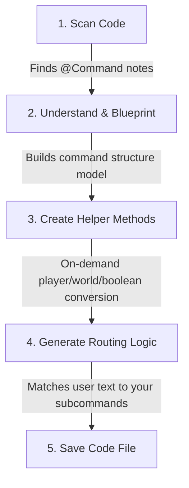

# Command Processor Flow

If you are new to annotations and code generation, this guide will help you understand how this command system automatically writes code for you behind the scenes.

---

## What is an Annotation Processor?

Imagine you are a head chef. Instead of writing out every single step of a recipe for your staff, you just write down key sticky notes:
* 🏷️ **`@Command`**: "This class is a command."
* 🏷️ **`@Subcommand`**: "This method is a sub-part of that command."
* 🏷️ **`@Optional`**: "This ingredient (argument) is optional."

The **Annotation Processor** is like an automated kitchen assistant. During compilation, it scans your code for these sticky notes, reads your methods, and automatically writes the complex, repetitive "boilerplate" code (called a **Wrapper Class**) that bridges Minecraft/Bukkit or custom CLI arguments to your Java code.

---

## The Processing Flow (High-Level)

Here is the step-by-step journey of how your annotated command becomes executable code:

---

## Detailed Step-by-Step Explanation

### 1. Scan Code
When you compile your project, the compiler starts the processor. It searches your files to find any classes marked with command annotations.

### 2. Understand & Blueprint
For every command it finds, the processor builds a blueprint (called a `CommandModel`) by asking questions:
* What is the name of this command? (e.g., `/teleport`)
* Does it have subcommands? (e.g., `/teleport here`, `/teleport all`)
* What inputs (arguments) does it require? (e.g., a target player name, a world name, or coordinates)
* Are any inputs optional?

### 3. Create Helper Methods (On-Demand)
To keep the generated files clean, the processor writes helper methods inside the wrapper class to do repeated tasks:
* **`asPlayer(sender)`**: Verifies if the person running the command is actually a player (and not the console), throwing a clear error message if they are not.
* **`getPlayer(name)` / `getWorld(name)`**: Converts a simple text argument typed by a user (e.g. `"hsgamer"`) into a real game object (like a `Player` or a `World`), handling errors if that player is offline or the world doesn't exist.
* **`suggestPlayers(current)`**: Automatically generates matching tab-completion recommendations as you type.

### 4. Generate Routing Logic
Next, the processor writes the code that executes when a player runs your command:
1. **Identify Subcommand:** It reads the first word typed (e.g. `here` in `/tp here player1`) to figure out which method to call.
2. **Upfront Length Check:** It checks if the player typed enough arguments. If they didn't, it displays the correct usage instructions automatically.
3. **Parse Parameters:** It calls the helpers created in Step 3 to convert text inputs into Java objects.
4. **Validation:** It runs validation checks (like checking if a number is between a minimum and maximum value).
5. **Execution:** Finally, it calls your actual method with the resolved parameters.

### 5. Save Code File
The processor saves the newly written Java class file (e.g. `TeleportCommand_Executor.java`) into the target directory of your project. This file is then compiled right along with your own code!
