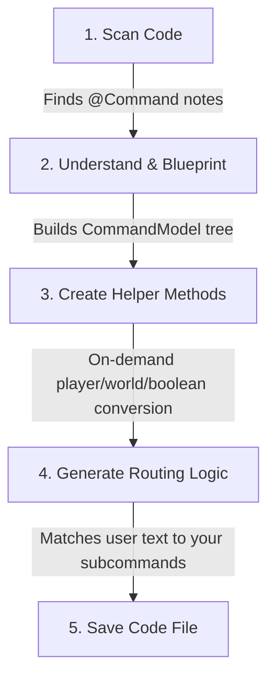
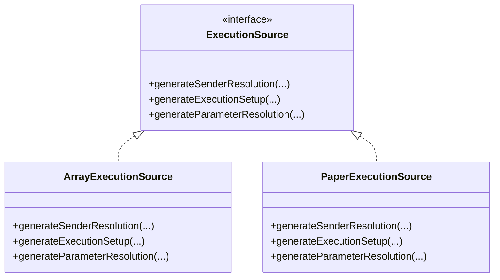

# Command Processor Flow

If you are new to annotations and code generation, this guide will help you understand how this command system automatically writes code for you behind the scenes.

---

## What is an Annotation Processor?

Imagine you are a head chef. Instead of writing out every single step of a recipe for your staff, you just write down key sticky notes:
* **`@Command`**: "This class is a command."
* **`@Subcommand`**: "This method is a sub-part of that command."
* **`@Optional`**: "This ingredient (argument) is optional."

The **Annotation Processor** is like an automated kitchen assistant. During compilation, it scans your code for these sticky notes, reads your methods, and automatically writes the complex, repetitive "boilerplate" code (called a **Wrapper Class**) that bridges Minecraft/Bukkit or custom CLI arguments to your Java code.

---

## The Processing Flow (High-Level)

Here is the step-by-step journey of how your annotated command becomes executable code:



---

## Unified Execution Architecture

To avoid duplicating logic across different platforms (Bukkit, Standalone, and Brigadier/Paper), the annotation processor uses a unified template pattern driven by the `ExecutionSource` interface.



### Execution Flow Sequence

For any command method execution, `BaseCommandProcessor.buildMethodExecution` ensures a single point of truth for the execution flow:
1. **Resolve Sender:** Platform-specific sender resolution (handled by `ExecutionSource.generateSenderResolution`).
2. **Execution Setup:** Static argument checks or setup (handled by `ExecutionSource.generateExecutionSetup`).
3. **Parameter Resolution:** Loop over method parameters and resolve them using built-in, local, or global resolvers (handled by `ExecutionSource.generateParameterResolution`).
4. **Parameter SPI Handlers:** Run parameter-level validation check annotations (like `@Min`, `@Max`, `@ValidateWith`).
5. **Execution:** Invoke the target Java method.

---

## Key Components

### Naming
Static helper that generates consistent identifiers for wrapper classes, resolver methods, and parameter variables.

### TypeSupport
Registry of 17 JDK types (String, int, Player, World, etc.) that replaces scattered if-chains. Maps each type to its resolver method, default value, and Brigadier expression.

### ResolverLookup
Compile-time lookups for `@Resolve` methods, suggest providers, and command model tree navigation.

### SpiLoader
Static SPI loading with explicit class loader and graceful fallback on `ServiceConfigurationError`.

### CommandFactory&lt;S&gt;
Runtime wrapper that caches a `MethodHandle` to each generated wrapper's `static factory(Object, CommandManager)` method. Platform managers use `CommandFactory` to create wrappers with zero reflection per `register()` call.

---

## Message Translation and Customization

Instead of maintaining static maps or configuration entries for error messaging inside the runtime libraries, `CommandManager` exposes a single overridable formatting method:

```java
public String formatMessage(String key, String defaultValue, Object... args) {
    try {
        return String.format(defaultValue, args);
    } catch (Exception e) {
        return defaultValue;
    }
}
```

To customize or translate messages (such as validation failures or usage alerts), subclass developers simply override `formatMessage` and route message keys to their own translation dictionary or localization system.

---

## Error Handling

All validation, resolver, and usage errors throw a `CommandException` directly to simplify the exception hierarchy and minimize runtime jar size. Subclass implementations can capture this exception to format and dispatch error feedback to the command sender.
